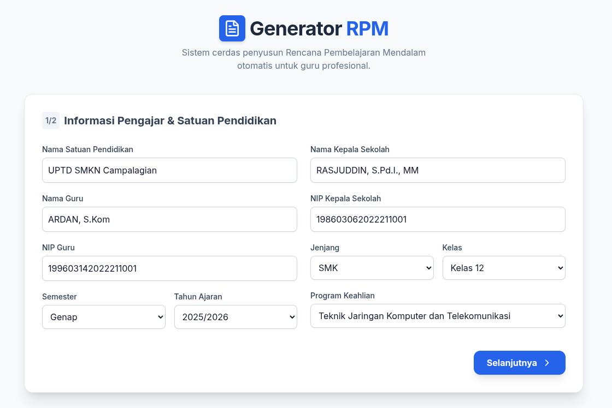
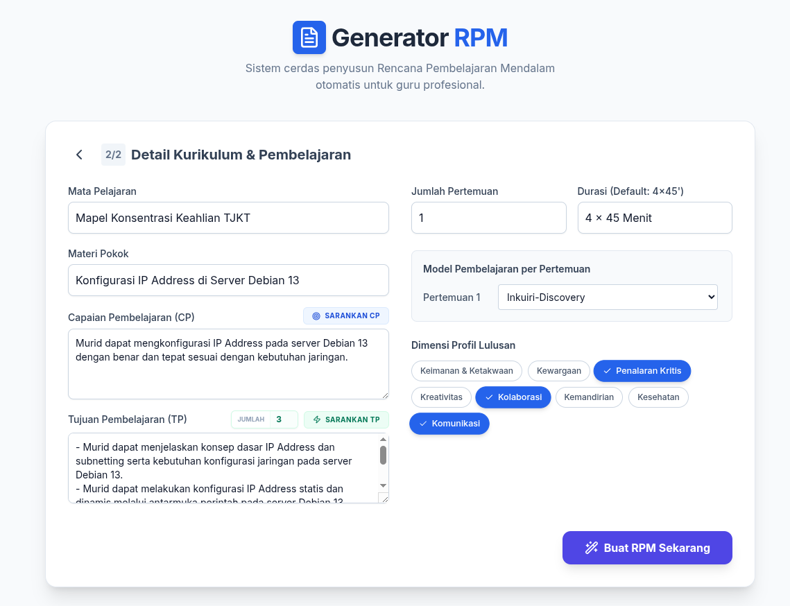
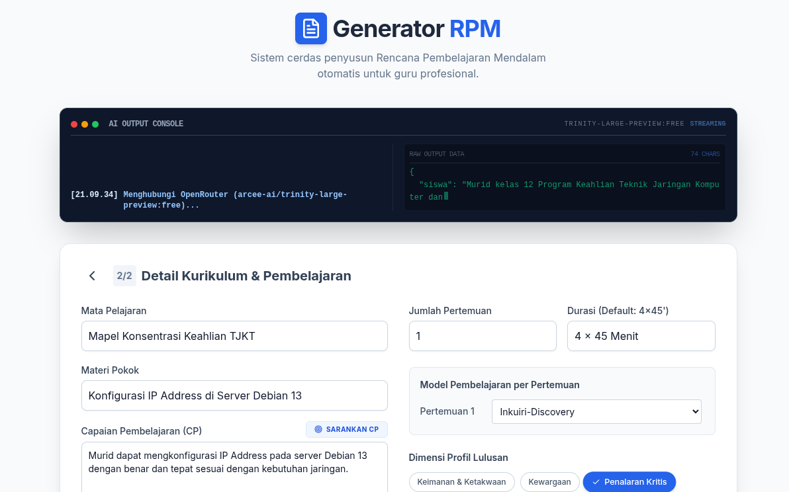
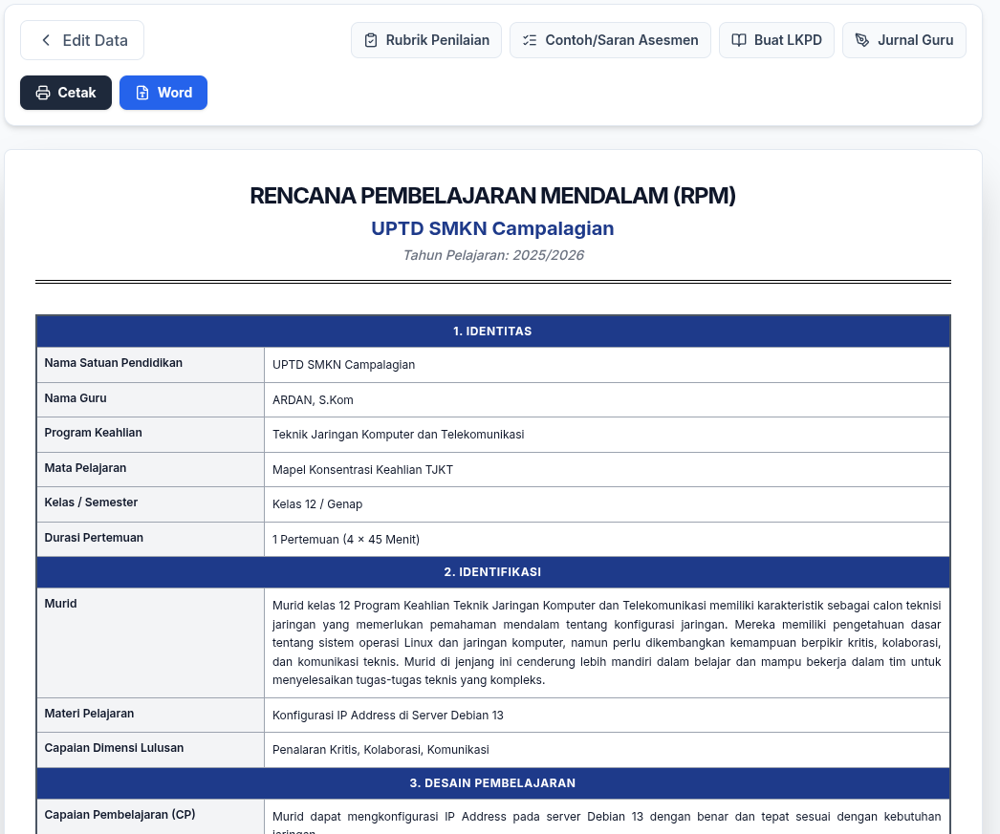
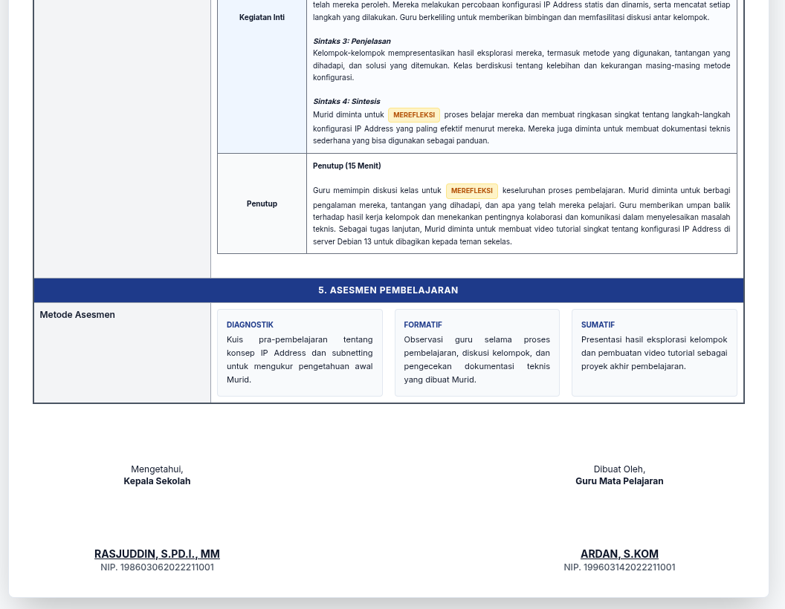
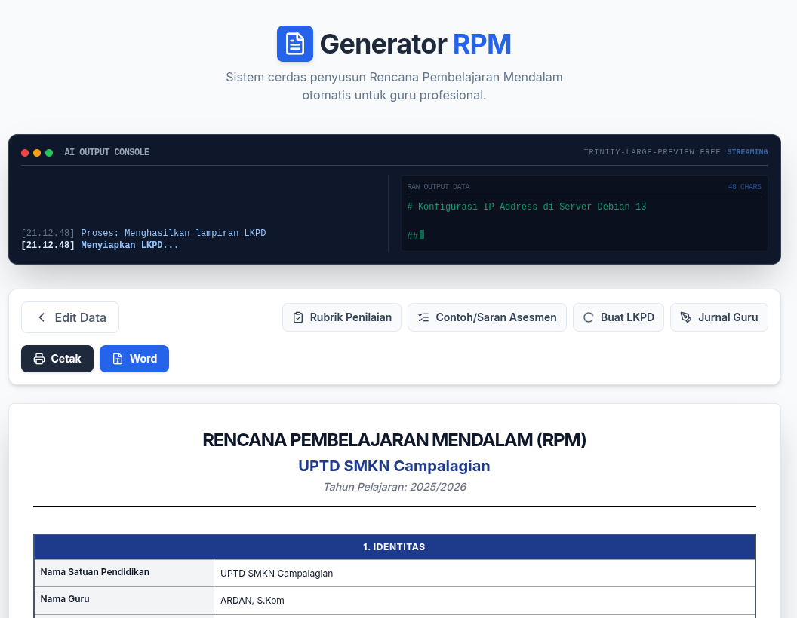
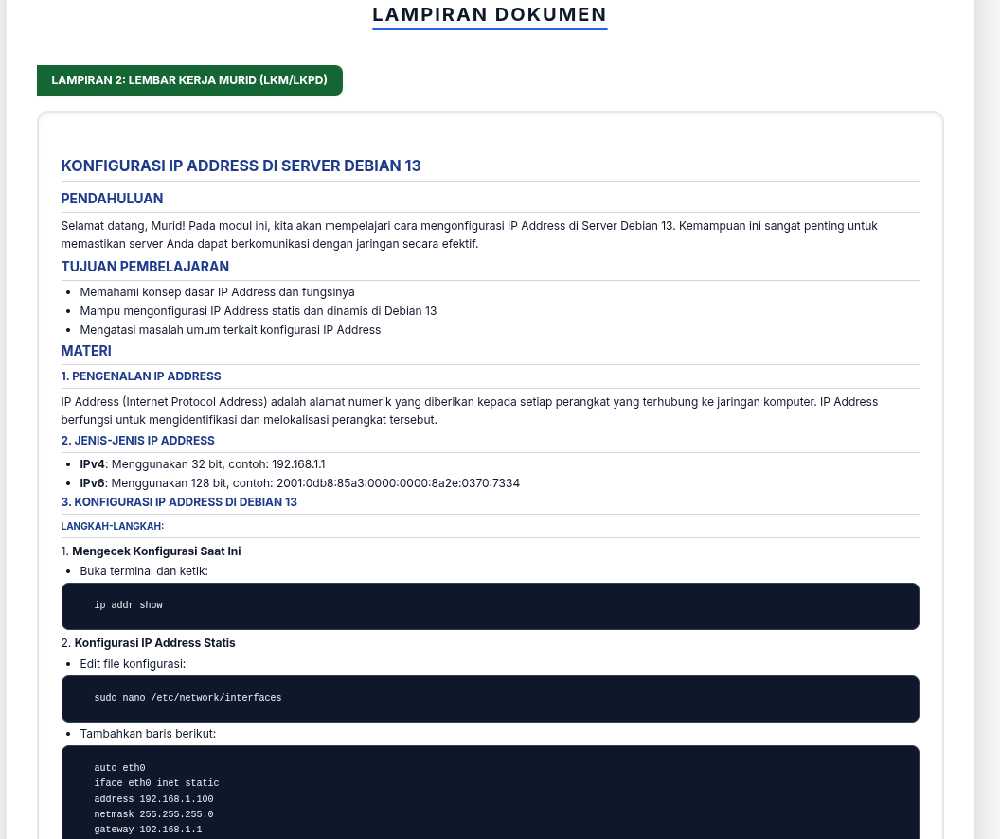
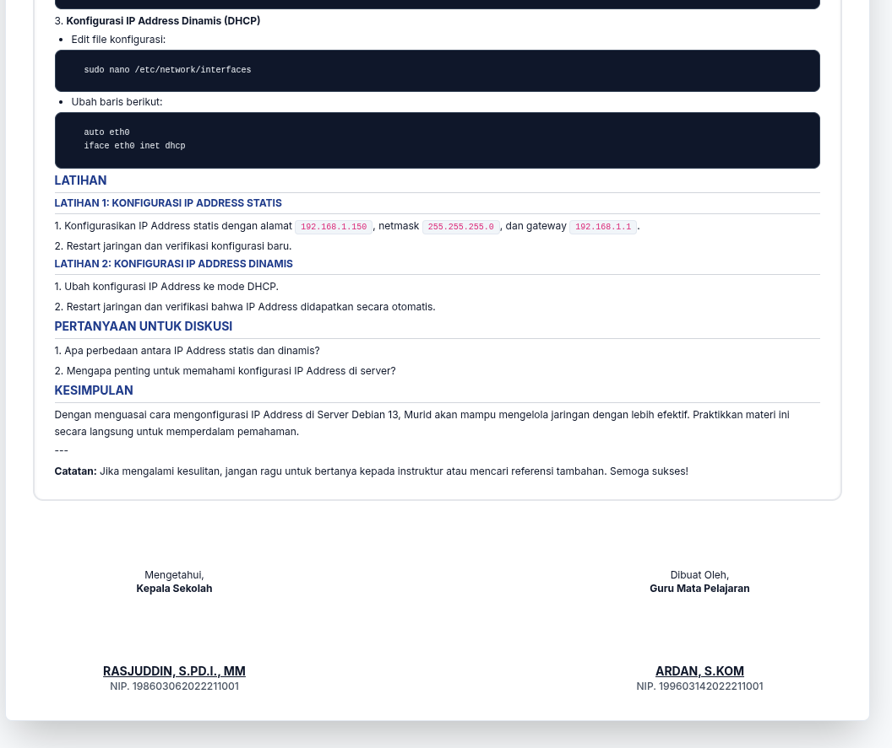

<div align="center">


# 🚀 Generator RPM (Rencana Pembelajaran Mendalam)
**Sistem Cerdas Penyusun Administrasi Guru Profesional Berbasis AI**
</div>

---

## 🌟 Tentang Proyek
**Generator RPM** adalah aplikasi web modern yang dirancang khusus untuk membantu guru profesional di Indonesia menyusun Rencana Pembelajaran Mendalam (RPM) secara otomatis dan berkualitas tinggi. Menggunakan integrasi **OpenRouter API**, aplikasi ini mendukung berbagai model bahasa besar (LLM) seperti Gemini 2.0 Flash, Claude 3.5 Sonnet, dan GPT-4o.

Aplikasi ini tidak hanya membuat rencana pembelajaran, tetapi juga menyediakan ekosistem administrasi lengkap mulai dari Capaian Pembelajaran (CP) hingga instrumen asesmen yang mendalam.

## ✨ Fitur Utama
- **⚡ AI Live Streaming:** Lihat proses berpikir AI secara real-time melalui konsol output yang transparan.
- **📚 Kurikulum Merdeka Ready:** Mendukung pembuatan CP dan TP yang selaras dengan standar nasional.
- **🛠️ Administrasi Lengkap:**
  - **Generate RPM:** Rencana pembelajaran detail per pertemuan.
  - **Generate LKPD:** Lembar Kerja Murid yang interaktif.
  - **Generate Rubrik:** Kriteria penilaian yang objektif.
  - **Jurnal Guru:** Refleksi proses mengajar secara sistematis.
  - **Asesmen:** Contoh soal diagnostik, formatif, dan sumatif.
- **🤖 Multi-Model AI:** Mendukung model apapun yang tersedia di OpenRouter.
- **📄 Ekspor Profesional:** Cetak langsung atau ekspor ke format **Microsoft Word (.docx)**.
- **⚙️ Pengaturan Fleksibel:** Simpan API Key dan pilihan model secara aman di LocalStorage browser.

## 📸 Cuplikan Layar
<div align="center">
  
  
  
  
  
  
  
  
</div>

## 🛠️ Teknologi yang Digunakan
- **Frontend:** [React 19](https://react.dev/), [Vite](https://vitejs.dev/), [TypeScript](https://www.typescriptlang.org/)
- **Styling:** [Tailwind CSS](https://tailwindcss.com/)
- **AI Integration:** [OpenRouter API](https://openrouter.ai/) (OpenAI SDK)
- **Icons:** [Lucide React](https://lucide.dev/)
- **Document Export:** [docx](https://docx.js.org/), [file-saver](https://github.com/eligrey/FileSaver.js/)

---

## 🚀 Panduan Instalasi

### Prasyarat
- [Node.js](https://nodejs.org/) (Versi 20+)
- **ATAU** [Docker](https://www.docker.com/) & [Docker Compose](https://docs.docker.com/compose/)

### 1. Kloning Repositori
```bash
git clone https://github.com/hex4coder/rpmbuilder.git
cd rpmbuilder
```

### 2. Konfigurasi API Key
Buat file `.env.local` di direktori utama dan tambahkan API Key OpenRouter Anda:
```env
OPENROUTER_API_KEY=your_api_key_here
```
*Dapatkan API Key di [OpenRouter.ai](https://openrouter.ai/keys).*

### 3. Menjalankan Aplikasi

#### Menggunakan Node.js (Lokal)
1. Instal dependensi:
   ```bash
   npm install
   ```
2. Jalankan server pengembangan:
   ```bash
   npm run dev
   ```
3. Buka browser: [http://localhost:3000](http://localhost:3000)

#### Menggunakan Docker (Rekomendasi)
1. Bangun dan jalankan container:
   ```bash
   docker compose up --build -d
   ```
2. Akses aplikasi: [http://localhost:3000](http://localhost:3000)

---

## 📝 Lisensi
Proyek ini dibuat untuk mendukung digitalisasi administrasi guru di Indonesia. Silakan gunakan dan kembangkan secara bertanggung jawab.

**Dibuat dengan ❤️ oleh [Ardan](https://github.com/hex4coder)**
